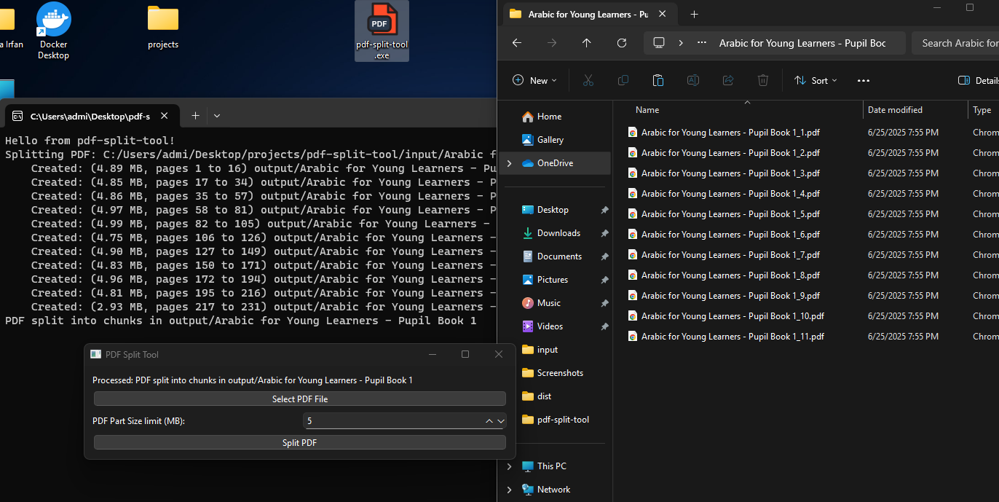

<br />

<div align="center">
  <h1>pdf-split-tool</h1>
  <p><h3 align="center">Split large PDF to smaller files 🚀</h3></p>
</div>

[Upwork Job Posting](https://www.upwork.com/jobs/~021937824974750097089)
&nbsp;&nbsp;•&nbsp;&nbsp;

<hr>

## App Demo Video

[](https://www.youtube.com/watch?v=FspeczCR_sg)

## Run
```sh
uv run main.py
```

## Build

```sh
uv run pyinstaller --onefile --clean --paths . main.py
```

```sh
uv run pyinstaller --onefile --noconsole --clean --paths . main.py
```

```sh
uv run pyinstaller pdf-split-tool.spec
```